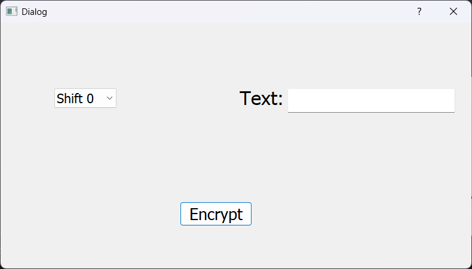
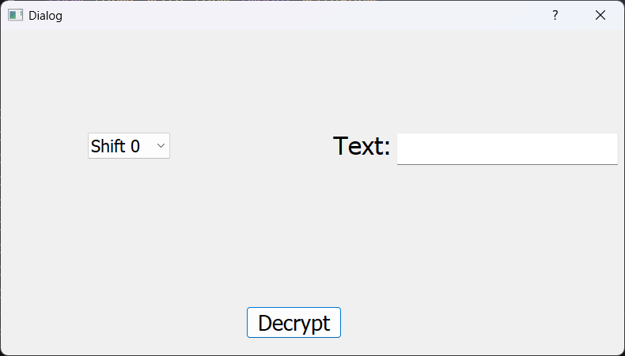

# Caesar Cryptography Tool

- In this programm, we **_decrypt_** and **_encrypt_** texts with **caesar cryptography algorhithm**.

---

## The First Page

- At first, you choose to decrypt a text from caesar to normal text,  
  or encrypt a normal text to encrypted caesar format.

---

## Encryption Page

- Here, you write your normal text at the text input.  
  Then, Choose to how much should the bot shift your text.  
  And after that, push the encrypt button. After that, the encrypted-  
  text will be shown to you and copied to clipboard.

---

## Decryption Page

- This is the decryption page, it's just like the encryption page.
- You write the encrypted caesar text, and then say how many shift it came.  
  Then, click decrypt and just like encrypt, it shows the decrypted text & copies  
  it to clipboard.

---

###### Hope you like it and enjoy using it.
